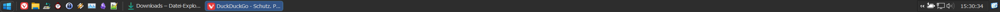
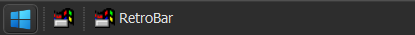
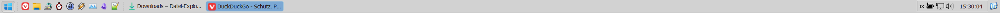
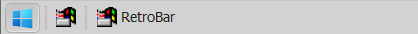

# Barnacle RetroBar Themes

A collection of RetroBar themes inspired by the classic Windows aesthetic.

## Themes Included

### Barnacle Dark
A dark theme featuring dark gray backgrounds with light text and blue accent colors. Perfect for low-light environments and reducing eye strain.




### Barnacle Light
A light theme featuring light gray backgrounds with dark text and light blue accent colors. Provides a clean, bright appearance similar to classic Windows 98/XP.



## Installation

Both the **Resources** and **Themes** folders must be extracted/copied to the RetroBar installation directory:

```
C:\Users\<user>\AppData\Local\RetroBar
```

### Step-by-Step Instructions

1. Extract/copy the `src/Resources` folder to `C:\Users\<user>\AppData\Local\RetroBar\`
2. Extract/copy the `src/Themes` folder to `C:\Users\<user>\AppData\Local\RetroBar\`
3. Launch RetroBar
4. Go to Settings and select your preferred theme (Barnacle Dark or Barnacle Light)

## Features

- Windows 10 icon styling
- Customized button styles with hover and pressed states
- Themed system tray area
- Gradient backgrounds for visual polish
- Light and dark variants for user preference


## Icons
- <a target="_blank" href="https://icons8.com/icon/gXoJoyTtYXFg/windows-10">Windows 10</a> icon (start11.png) by <a target="_blank" href="https://icons8.com">Icons8</a>
- the other icons are the originals from the Retrobar repository.
